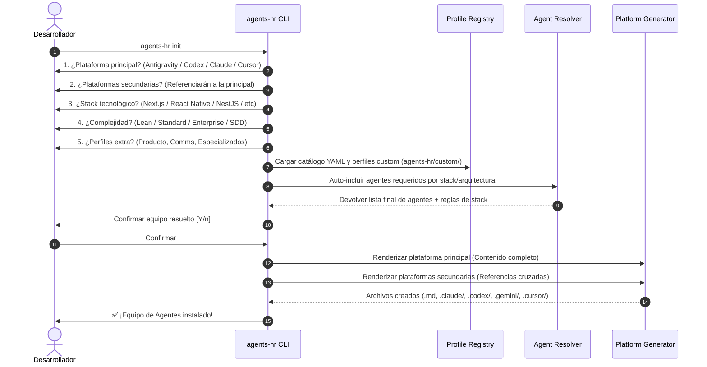

<div align="center">

# 🏢 Agents-HR
### *Agencia de Recursos Humanos para Agentes AI en Proyectos de Software Web y Móvil*

[](https://www.typescriptlang.org/)
[](https://nodejs.org/)
[](https://vitest.dev/)
[](LICENSE)
[](#-plataformas-soportadas)

<p align="center">
  <b>Armá tu equipo agéntico de desarrollo en menos de 1 minuto.</b><br/>
  Agents-HR es una herramienta CLI interactiva que inspecciona tu stack tecnológico y arquitectura para desplegar automáticamente un equipo multidisciplinario de agentes AI (Técnicos, Producto, Comunicación y Especialistas) optimizado para tu entorno de desarrollo.
</p>

[🚀 Quick Start](#-quick-start) • [📋 Catálogo de Agentes](#-catálogo-de-perfiles-22) • [🏗️ Arquitectura de Referencia](#%EF%B8%8F-arquitectura-de-referencia-cruzar-plataformas) • [⚙️ Comandos CLI](#%EF%B8%8F-referencia-de-comandos-cli)

---

</div>

## 💡 ¿Por qué Agents-HR?

Los asistentes y agentes de código AI actuales (Claude Code, OpenAI Codex CLI, Google Antigravity, Cursor) requieren instrucciones claras y estructuradas para rendir al máximo nivel. Configurar manualmente cada rol (Tech Lead, QA, Product Manager, Security) duplica esfuerzos y genera configuraciones inconsistentes.

**Agents-HR resuelve esto actuando como una Agencia de RRHH digital:**
1. **Selección Inteligente**: Responde a un cuestionario interactivo CLI sobre tu plataforma, stack y complejidad.
2. **Despliegue Automático**: Genera la estructura de instrucciones, reglas y habilidades específicas para tu herramienta AI.
3. **Single Source of Truth**: Define una plataforma principal con contenido completo y plataformas secundarias que la referencian sin duplicación.
4. **Reglas de Producción 2026**: Cada perfil técnico incluye reglas estrictas para **Next.js 15+**, **React Native (Expo)** y **NestJS**.

---

## ⚡ Quick Start

### Instalación / Ejecución Local

Podés clonar el repositorio y usar el ejecutable integrado:

```bash
# 1. Clonar el repositorio
git clone https://github.com/iblackpixel/agents-hr.git
cd agents-hr

# 2. Instalar dependencias y compilar
npm install
npm run build

# 3. Vincular globalmente (opcional)
npm link
```

### Inicialización en un Proyecto Nuevo

Navegá a la carpeta de tu nuevo proyecto y ejecutá:

```bash
agents-hr init
```

> **Simulación (Dry-Run)**: Si querés previsualizar qué archivos creará sin escribir en el disco:
> ```bash
> agents-hr init --dry-run
> ```

---

## 🛠️ Flujo de Inicialización CLI



---

## 📋 Catálogo de Perfiles (22+ Agentes)

Agents-HR incluye un catálogo preconfigurado en formato YAML dividido en 4 áreas clave:

### 🔧 Perfiles Técnicos (Core)
| Emoji | ID | Rol | Responsabilidad Principal | Auto-incluido en |
|---|---|---|---|---|
| 🏗️ | `tech-lead` | **Tech Lead** | Arquitectura principal, ADRs, estándares de código y code reviews | Lean, Standard, Enterprise |
| 🎨 | `frontend-dev` | **Frontend Developer** | UI/UX responsiva, accesibilidad, componentes y Core Web Vitals | Standard, Enterprise |
| ⚙️ | `backend-dev` | **Backend Developer** | APIs REST/GraphQL, controladores, servicios y lógica de negocio | Standard, Enterprise |
| 📱 | `mobile-dev` | **Mobile Developer** | Desarrollo nativo/híbrido iOS/Android con Expo Router | Mobile Stacks |
| 🔄 | `fullstack-dev` | **Fullstack Developer** | Desarrollo end-to-end tipo-seguro en equipos livianos | Lean |
| 🚀 | `devops` | **DevOps Engineer** | Pipelines CI/CD, Docker, Kubernetes, Vercel, EAS Build y monitoreo | Standard, Enterprise |
| 🧪 | `qa-engineer` | **QA Engineer** | Pruebas automatizadas (Vitest, Playwright, Jest), prevención de regresiones | Lean, Standard, Enterprise |
| 🗄️ | `db-architect` | **Database Architect** | Modelado de datos, optimización de queries SQL/NoSQL y migraciones | Database Stacks |
| 🔒 | `security` | **Security Engineer** | Auditorías OWASP, cifrado, sanitización y cabeceras de seguridad | Enterprise |

### 📋 Perfiles de Producto
| Emoji | ID | Rol | Responsabilidad Principal |
|---|---|---|---|
| 📋 | `product-manager` | **Product Manager** | Visión de producto, roadmap, PRDs, backlog y SDD |
| 🎯 | `ux-designer` | **UX/UI Designer** | Wireframes, prototipos, Design Systems en Figma y usabilidad |
| 🔍 | `ux-researcher` | **UX Researcher** | Pruebas de usabilidad, entrevistas, mapas de empatía y benchmarking |
| 📊 | `business-analyst` | **Business Analyst** | Diagramas de proceso (BPMN), reglas de negocio y requisitos |
| 🏃 | `scrum-master` | **Scrum Master** | Facilitación ágil, eliminación de bloqueos y métricas en Linear/Jira |
| 📈 | `data-analyst` | **Data Analyst** | Telemetría, funnels de conversión, cohortes y tracking plans |

### 📢 Perfiles de Comunicación
| Emoji | ID | Rol | Responsabilidad Principal |
|---|---|---|---|
| 📝 | `tech-writer` | **Technical Writer** | Documentación de arquitectura, READMEs, manuales API (OpenAPI) y JSDoc |
| ✍️ | `copywriter` | **UX Copywriter** | Microcopy de interfaz, onboarding, mensajes de error empáticos |
| 📣 | `pr-comms` | **PR & Comms** | Release notes, Changelogs (Keep a Changelog) y comunicados |

### 🎯 Perfiles Especializados
| Emoji | ID | Rol | Responsabilidad Principal |
|---|---|---|---|
| ♿ | `accessibility` | **a11y Specialist** | Cumplimiento WCAG 2.1 AA/AAA, ARIA, lectores de pantalla |
| ⚡ | `performance` | **Performance Engineer** | Profiling, optimización de bundles, lazy loading, Core Web Vitals |
| 🌍 | `i18n` | **i18n Engineer** | Internacionalización, localización de moneda/fechas, layouts RTL |
| 🤖 | `ai-ml` | **AI/ML Engineer** | Integración de LLMs, RAG (Vector DBs), Prompt Engineering y Agent Tools |

---

## 🌐 Plataformas Soportadas (Especificaciones 2026)

Agents-HR genera estructuras adaptadas a los estándares oficiales más recientes:

```
mi-proyecto/
├── agents-hr/
│   └── config.yml                      # Configuración del equipo actual
├── GEMINI.md                           # 📦 PRIMARIO (Contenido completo)
├── CLAUDE.md                           # 🔗 SECUNDARIO (@import GEMINI.md)
├── AGENTS.md                           # 🔗 SECUNDARIO (Referencia a GEMINI.md)
│
├── .gemini/rules/                      # Antigravity Rules
│   ├── tech-lead.md
│   └── frontend-dev.md
│
├── .claude/agents/                     # Subagentes Nativos de Claude Code
│   ├── tech-lead.md (con YAML frontmatter)
│   └── frontend-dev.md
│
├── .codex/skills/                      # Progressive Disclosure Skills de Codex CLI
│   ├── tech-lead/SKILL.md
│   └── frontend-dev/SKILL.md
│
└── .cursor/rules/                      # Modern MDC Rules de Cursor
    ├── tech-lead.mdc (con globs y frontmatter)
    └── frontend-dev.mdc
```

---

## 📐 Reglas Estrictas por Stack Tecnológico

Cada perfil técnico ajusta automáticamente sus directivas según el stack elegido:

### ⚛️ Next.js 15+ (App Router)
- **Server Components** por defecto; Client Components (`"use client"`) solo en nodos de hoja interactivos.
- **Server Actions** con validación mediante esquemas **Zod**.
- **Metadata API** dinámica obligatoria por ruta.
- `Middleware` centralizado para autorización y headers de seguridad.

### 📱 React Native (Expo SDK 51+)
- **Expo Router** para navegación declarativa basada en archivos.
- Estilos utilitarios con **Nativewind v4** o **Tamagui** (prohibido inline `StyleSheet`).
- **React Query** para manejo de estado del servidor y sincronización offline.
- Renderizado de listas masivas optimizado mediante `@shopify/flash-list`.

### 🪺 NestJS 10+ (Enterprise Backend)
- Arquitectura modular estricta por dominio funcional (`feature.module.ts`).
- DTOs fuertemente tipados y validados con `class-validator`.
- Respuestas de error estandarizadas bajo el formato **RFC 7807 Exception Filters**.
- Procesamiento asincrónico distribuido con **BullMQ** y **Redis**.

---

## 🧩 Perfiles Custom del Usuario

Podés crear perfiles de agentes propios específicos para tu organización sin modificar el catálogo global.

Simplemente creá un archivo YAML en `agents-hr/custom/` dentro de tu proyecto:

```yaml
# agents-hr/custom/mi-agente-custom.yml
id: seo-specialist
name: "SEO Specialist"
emoji: "🔎"
category: specialist
description: "Especialista en SEO técnico y Schema.org para Next.js"
system_prompt: |
  Sos el SEO Specialist del equipo. Tu tarea es asegurar que cada ruta
  cuente con meta tags adecuados, OpenGraph y marcado JSON-LD.
stack_rules:
  nextjs:
    - "Generar Metadata API dinámica en app/(features)/[slug]/page.tsx"
    - "Verificar que el sitemap.xml y robots.txt se generen estáticamente"
```

Al ejecutar `agents-hr sync`, tu agente custom se incluirá automáticamente en la arquitectura de la plataforma.

---

## ⚙️ Referencia de Comandos CLI

```bash
# 🚀 Inicialización interactiva en el proyecto actual
agents-hr init

# 📋 Listar agentes disponibles en el catálogo (con filtro opcional)
agents-hr list
agents-hr list --category tech
agents-hr list --category product

# ➕ Agregar un agente del catálogo al proyecto actual
agents-hr add security
agents-hr add ux-designer

# ➖ Remover un agente del equipo del proyecto
agents-hr remove copywriter

# 🔄 Sincronizar y regenerar archivos desde agents-hr/config.yml
agents-hr sync

# 🏢 Inspeccionar el equipo instalado en la carpeta actual
agents-hr team

# 🧹 Limpiar la estructura agéntica del proyecto actual para empezar de cero
agents-hr clean
agents-hr clean --keep-custom   # Preserva carpeta agents-hr/custom/
agents-hr clean --dry-run       # Simula los archivos a eliminar sin tocar disco
agents-hr clean -f              # Salta la confirmación interactiva

# 🔄 Reiniciar la arquitectura agéntica e iniciar init en 1 solo paso
agents-hr reset
```

---

## 🧪 Testing y Desarrollo

El proyecto cuenta con una suite completa de pruebas unitarias creadas con **Vitest**:

```bash
# Ejecutar tests una vez
npm test

# Ejecutar tests en modo watch durante desarrollo
npm run test:watch

# Compilar TypeScript a dist/
npm run build
```

---

## 🤝 Contribuciones

¡Las contribuciones son bienvenidas! Podés contribuir agregando nuevos perfiles de agentes en `agents/`, mejorando los templates en `templates/` o agregando soporte para nuevos stacks tecnológicas.

1. Hacé un Fork del repositorio (`https://github.com/iblackpixel/agents-hr/fork`)
2. Creá una rama para tu característica (`git checkout -b feat/nuevo-perfil`)
3. Realizá los cambios y agregá pruebas (`npm test`)
4. Hacé Commit de tus cambios (`git commit -m 'feat: agregar perfil de Data Engineer'`)
5. Hacé Push a la rama (`git push origin feat/nuevo-perfil`)
6. Abrí un Pull Request.

---

## 📄 Licencia

Este proyecto está bajo la Licencia **MIT**. Consultá el archivo [LICENSE](LICENSE) para más detalles.

---

<div align="center">
  Hecho con ❤️ para la comunidad de desarrolladores y agentes AI por <b>iblackpixel</b>
</div>
